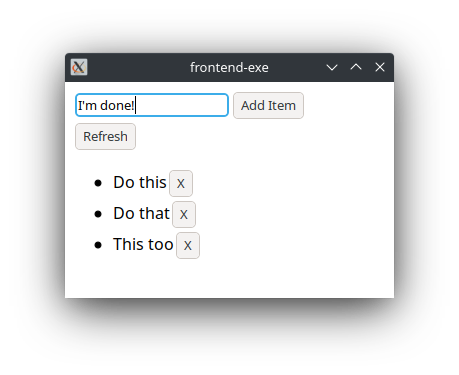

# Template Project For haskell.nix and reflexfrp

This template project acts as a reference for anyone wanting to create
an app that:

- Has a frontend communicating with a backend.
- Is able to cross-compile the frontend to a GTK application or a
  javascript application. (iOS and Android coming up).
- Uses Haskell for the frontend and the backend.
- Uses Warp to serve HTTP requests on the backend.
- Shares an API specification between the backend and the frontend
  using servant.
- Uses functional reactive programming on the frontend.
- Where the backend communicates with a Postgresql database.
- Uses nix to provide all the needed tools and packages.
  
The application itself is a very crude TODO list application which
stores the list inside a Postgresql database. To get a desktop
application, run:

```bash
nix-shell
cabal run backend-exe &
cabal run frontend-exe
```



To quit the app, issue a `Ctrl-C` then `fg` then `Ctrl-C`.

To generate javascript code for the frontend, run:

```bash
cabal build --cabal-file=cabal.ghcjs.project --ghcjs frontend
```

## Links

- [Building instructions](docs/HowTos/BuildTestRun.md)
- [FAQ](docs/Discussions/FAQ.md)

Check all the documentation at [docs/](docs/).

## WIP

- [x] Accept arguments for backend.
- [ ] Accept config file for backend.
- [ ] Allow frontend to setup backend endpoint through UI.
- [ ] Serve the javascript frontend from the backend.
- [ ] Nix provides ghcjs.
- [ ] Cross-compile frontend to iOS.
- [ ] Cross-compile frontend to Android.
- ?
